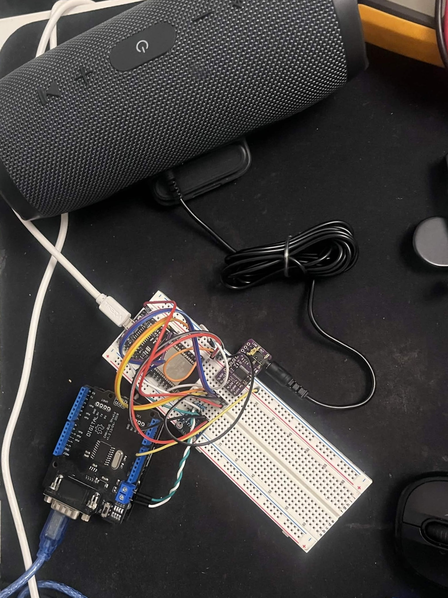

This is my implementation of my ESP32 Bluetooth Transceiver. 

The goal of the project is to add Bluetooth to my car (2011 Bmw 328i), streaming music from my iPhone to the ESP32, which then sends it to the PCM5102A DAC via I2S. 

In addition, I have a SN65HVD230 CAN transceiver, creating a CAN listening device that will hopefully read the steering wheel button inputs for media control. 

So far, the Bluetooth is working. I am in the process of configuring the CAN communication via TWAI on the ESP32. I am using a Arduino Uno with a MCP2515 CAN Shield as a test bench such that I can develop the Bluetooth protocol that can pause, skip tracks, and potentially more functions based on the CAN messages around the steering wheel controls.

I am using this repository as my CAN bus database reference: https://github.com/BMW-E8x-E9x/opendbc/blob/master/opendbc/dbc/bmw_e9x_e8x.dbc

Physical setup:

The Arduino is running the send_Blink example code from the CAN_BUS_SHIELD library by Seeed Studio. My objective is to use it as an emulation device mimicking the K-CAN line on the bmw e90 platform, specifically the messages pertaining to the steering wheel buttons, like next track, previous track, and retrofitting some of the other buttons for other controls. I am currently working on the overall CAN implementation on the ESP32 side before I continue further. 

The hardware setup consists of four main pieces: an ESP32 DevKit-C, SN65HVD230 CAN Bus Transceiver Communication-module, DAC GY-PCM5102 I2S Player Module, and an LM2596 buck converter. I might have some problems with the regulator, but I will use it for now and see how it goes. 